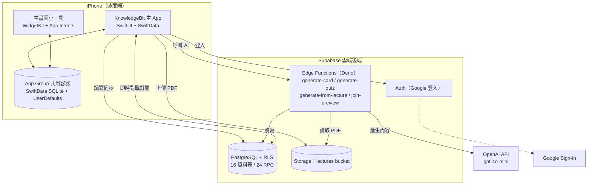
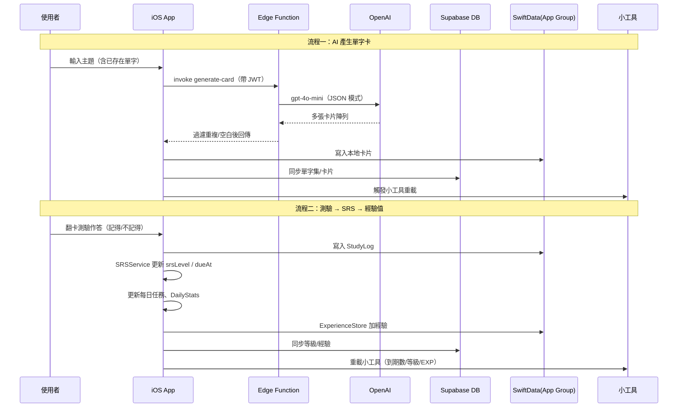

# KnowledgeBit 作品報告

> 本文件為 KnowledgeBit 專案之正式作品報告，內容基於對整個程式碼庫（iOS 主 App、Widget Extension、Supabase 後端 Edge Functions 與資料庫 Migration）的實際分析撰寫。凡屬無法由程式碼直接確認、需由團隊判斷之內容，均標示「**推測**」；凡屬需團隊額外提供之資訊，均列於「**需要補充資訊**」。

---

## 一、隊伍名稱

專案內未發現正式隊伍名稱（git 設定、README、設定檔皆無）。以下依專案主題「碎片時間 × 遊戲化學習」提供建議名稱，**推測**團隊可自行採用或調整：

- **建議隊伍名稱：知識位元（KnowledgeBit Team）**
- 備選：碎片知識實驗室（FragKnowledge Lab）、BitLearn Studio

> **需要補充資訊**：團隊是否已有正式報名用隊伍名稱？若有請以官方名稱為準。

---

## 二、作品名稱

- **正式作品名稱：KnowledgeBit — 用碎片時間掌握知識**
- 英文副標（**推測**，供海報/簡報使用）：*KnowledgeBit — Turn idle moments into knowledge.*
- 一句話定位：一款結合「主畫面小工具被動輸入」與「主動回憶測驗」的 iOS 遊戲化單字卡學習 App。

作品名稱「KnowledgeBit」具雙關：`Bit`（位元）呼應「碎片化、最小知識單位」，亦呼應遊戲化的數位化學習體驗。

---

## 三、創作動機與目的

### 3.1 為什麼想做這個專案
現代人多以零碎時間（通勤、排隊、課間）使用手機，但傳統學習 App 都要求使用者「主動打開、主動坐下來學」，與碎片化的生活節奏不相符，導致：使用者下載後容易遺忘、學習無法持續、複習時機錯過。

KnowledgeBit 的核心出發點是：**把學習內容直接送到使用者每天都會看到的地方——iPhone 主畫面**，將「想到才學」轉為「看到就學」。

### 3.2 現有問題
1. **啟動成本高**：傳統單字 App 需主動開啟，碎片時間難以觸發學習行為。
2. **遺忘曲線未被妥善利用**：多數工具不具備科學的間隔複習（SRS）排程，使用者不知道「今天該複習什麼」。
3. **學習動機難以維持**：缺乏即時回饋與社交誘因，容易半途而廢。
4. **內容建立費時**：手動建立單字卡與測驗題曠日廢時，降低使用意願。

### 3.3 希望解決的痛點
- 以 **WidgetKit 主畫面小工具** 降低啟動成本，讓知識「被動曝光」。
- 以 **SRS 間隔複習演算法** 自動排程「今日到期」卡片，精準對抗遺忘曲線。
- 以 **遊戲化機制**（連續天數、等級經驗值、每日任務、好友對戰）維持長期動機。
- 以 **AI 自動生成**（依主題生單字卡、依卡片生選擇題、講義 PDF 轉教材）大幅降低內容建立門檻。

### 3.4 專案核心價值
> **「讓學習發生在你沒打算學習的時候。」**

KnowledgeBit 的價值不在於「再做一個單字卡 App」，而在於把「被動輸入（主畫面小工具）→ 主動回憶（測驗／複習）→ 正向回饋（經驗值／連勝／社交對戰）」串成一個**完整且自我強化的學習迴圈**，並用 AI 降低使用者維護內容的成本。

---

## 四、作品構想與特色

### 4.1 整體概念
KnowledgeBit 由三個協同運作的部分組成：

1. **iOS 主 App（SwiftUI）**：學習、測驗、複習、社群、對戰的主要場域。
2. **主畫面小工具（WidgetKit）**：被動曝光單字與對戰戰況，透過 App Group 與主 App 共用同一份本地資料庫。
3. **Supabase 雲端後端**：登入驗證、跨裝置同步、AI 生成代理、即時對戰狀態。

### 4.2 使用流程（端到端）
1. 以 **Google 帳號登入**（Supabase Auth）。
2. 建立或同步**單字集**（可手動新增、AI 依主題生成、或上傳**講義 PDF 自動轉成教材**）。
3. 將某單字集**設為主畫面小工具來源**，平時於主畫面被動瀏覽單字。
4. 回到 App 進行**每日測驗**（翻卡）、**SRS 複習**（今日到期卡）、或 **AI 選擇題測驗**。
5. 作答結果即時更新 **SRS 排程、學習紀錄（StudyLog）、每日任務進度、經驗值與等級**。
6. 透過**連續天數（Streak）、學習熱力圖、成就統計**檢視長期成效。
7. 與好友**共編單字集**、發起**戰略對戰**（準備期累積能量 KE，對戰期於格子地圖攻防）。

### 4.3 使用者體驗重點
- **零啟動成本**：主畫面小工具每 15 分鐘輪播一批卡片，iOS 17+ 可用左右箭頭互動切換（App Intents）。
- **即時正向回饋**：3D 翻卡動畫、答題彩帶（Confetti）、經驗值上升動畫、連勝視覺化週曆。
- **無痛內容建立**：輸入主題即可 AI 生成多張卡片，並自動排除單字集內已有單字避免重複。
- **科學複習**：系統主動告知「今日到期」數量，使用者不需自行判斷複習時機。
- **社交驅動**：好友邀請（邀請碼 / QR Code / 網頁連結）、單字集共編、即時對戰。

### 4.4 與一般方案相比的特色
| 面向 | 一般單字 App | KnowledgeBit |
|------|--------------|--------------|
| 觸發學習方式 | 需主動開啟 | 主畫面小工具被動曝光 + 通知提醒 |
| 複習機制 | 多為固定清單 | SRS 間隔演算法，依答題動態排程 |
| 內容建立 | 手動輸入 | AI 生卡 / AI 出題 / 講義 PDF 轉教材 |
| 動機維持 | 少 | 連勝、等級、每日任務、成就、好友對戰 |
| 社交性 | 弱 | 共編單字集 + 戰略對戰 + 好友系統 |

### 4.5 創新點
1. **被動 + 主動雙迴圈**：以小工具承載「被動輸入」，以測驗承載「主動回憶」，二者經 App Group 共用資料無縫銜接。
2. **遊戲化對戰結算下放至資料庫**：對戰的回合運算與結算以 PostgreSQL RPC（如 `compute_one_battle_step`、`submit_battle_allocations`）實作，確保雙方狀態一致與防作弊（**推測**：避免純前端結算被竄改）。
3. **AI 三合一內容生成**：單字卡、選擇題、講義 PDF → 摘要＋學習卡＋測驗，皆透過 Edge Function 代理，API Key 不落地於前端。
4. **Deep Link 整合社交與對戰**：`knowledgebit://battle?...`、`knowledgebit://join/<code>` 等將網頁邀請、QR Code 與 App 內導航打通。

---

## 五、與市場現有 App 比較

### 5.1 類似產品
- **Anki**：開源 SRS 卡片工具，複習演算法強，但介面工程化、無遊戲化、無原生小工具與 AI 生成。
- **Quizlet**：題庫與測驗模式豐富、有社群題庫，但偏「題庫平台」，SRS 與主畫面被動學習較弱。
- **Duolingo**：遊戲化與動機維持極強，但內容為平台預設課程，使用者無法自由建立任意主題單字集。
- **Memrise**：影片情境 + 間隔複習，內容仍以官方課程為主。

### 5.2 比較表
| 項目 | Anki | Quizlet | Duolingo | **KnowledgeBit** |
|------|------|---------|----------|------------------|
| SRS 間隔複習 | ✅ 強 | △ 部分 | △ 隱性 | ✅ 內建（10分→1天→3天→7天…） |
| 主畫面小工具被動學習 | ✗ | ✗ | ✗ | ✅ 單字卡 + 對戰地圖小工具 |
| 自建任意主題內容 | ✅ | ✅ | ✗ | ✅ |
| AI 自動生成內容 | ✗（需外掛） | △ 部分付費 | ✗ | ✅ 生卡／出題／講義 PDF 轉教材 |
| 遊戲化動機（連勝/等級/任務） | ✗ | △ | ✅ 強 | ✅ 連勝＋等級＋每日任務＋成就 |
| 好友社交 / 共編 | △ | ✅ 題庫分享 | △ 排行榜 | ✅ 好友＋單字集共編 |
| 即時對戰玩法 | ✗ | △（Quizlet Live） | ✗ | ✅ 戰略地圖回合制對戰 |
| 平台 | 跨平台 | 跨平台 | 跨平台 | iOS 原生（深度整合 WidgetKit） |

> 註：上表對競品功能之描述為一般市場認知與**推測**，未經逐一實測；正式報告如需引用請補充各 App 之最新官方資料。

### 5.3 本作品優勢與定位
- **定位**：「碎片時間 × 自建內容 × 遊戲化」的 iOS 原生學習工具。
- **差異化優勢**：同時具備 Anki 的科學複習、Quizlet 的自由建題、Duolingo 的動機設計，並獨有「主畫面被動學習」與「即時戰略對戰」，且以 AI 解決內容建立門檻。
- **適用對象**：語言學習者、準備考試的學生、想用零碎時間累積專業詞彙（如資工、醫護）的在職者。

---

## 六、架構設計說明

### 6.1 前端架構（iOS App）
- **語言／框架**：Swift + SwiftUI（宣告式 UI）。
- **分層**（依命名慣例，組織清晰）：
  - View（`*View.swift`）：畫面，如 `HomeView`、`WordSetDetailView`、`QuizView`、`BattleRoomView`。
  - ViewModel（`*ViewModel.swift`）：畫面狀態與邏輯，如 `CommunityViewModel`、`StrategicBattleViewModel`。
  - Service（`*Service.swift`）：業務邏輯與後端呼叫，如 `AuthService`、`AIService`、`SRSService`、`BattleRoomService`、`ChallengeService`。
  - Store（`*Store.swift`）：本地狀態，多以 App Group UserDefaults 持久化，如 `ExperienceStore`、`BattleEnergyStore`、`PendingInviteStore`。
  - Model：SwiftData 模型 `Card`、`WordSet`、`UserProfile`、`DailyStats`、`StudyLog`。
- **本地持久化**：SwiftData（底層 Core Data / SQLite），透過 `ModelContainer(groupContainer:)` 建立於 App Group 容器中。
- **小工具**：WidgetKit + App Intents（互動切換卡片），與主 App 共用同一 SwiftData 容器與 UserDefaults。

### 6.2 後端架構（Supabase）
- **Auth**：Supabase Auth + Google Sign-In。
- **資料庫**：PostgreSQL，啟用 Row Level Security（RLS）。共 **16 張資料表**、**24 個 RPC 函式**（部分對戰與權限邏輯下放至 DB）。
- **Edge Functions**（Deno / TypeScript，共 4 個）：作為 AI 代理層與網頁預覽，敏感金鑰僅存於 Function Secrets。
- **Storage**：`lectures` bucket 儲存使用者上傳的講義 PDF（含路徑前綴權限政策）。

### 6.3 API 與第三方服務
| 服務 | 用途 |
|------|------|
| Supabase Auth | 登入驗證、Session 管理 |
| Supabase PostgreSQL + RLS | 雲端資料、權限控管 |
| Supabase Edge Functions | AI 生成代理、邀請連結網頁預覽 |
| Supabase Storage | 講義 PDF 儲存 |
| OpenAI API（`gpt-4o-mini`） | 生單字卡、生選擇題、講義 PDF 轉教材（Chat Completions 與 Responses API） |
| Google Sign-In | 第三方登入 |

### 6.4 資料庫主要資料表
| 資料表 | 用途 |
|--------|------|
| `user_profiles` | 使用者頭像、名稱、等級、經驗、邀請碼 |
| `word_sets` | 單字集 |
| `cards` | 單字卡（歸屬單字集） |
| `study_logs` | 學習紀錄（供連勝、熱力圖、統計） |
| `friend_requests` / `friendships` | 好友請求與好友關係 |
| `word_set_collaborators` / `word_set_invitations` | 單字集共編者與邀請 |
| `battle_rooms` / `battle_board_state` / `battle_allocations` / `battle_energy` | 對戰房間、地圖狀態、佔格配置、能量（KE） |
| `challenge_sessions` | 非同步挑戰賽局 |
| `lecture_jobs` / `lecture_results` / `lecture_files` | 講義非同步處理任務、結果、檔案快取 |
| `user_ai_daily_usage` | AI 每日使用量配額 |

### 6.5 系統架構圖（Mermaid）

### 6.6 資料流圖（Mermaid）— 以「AI 生卡」與「測驗→SRS→經驗值」為例

---

## 七、主要功能與技術

### 7.1 核心功能與用途（依模組分類）

**A. 學習與複習**
| 功能 | 用途 | 關鍵實作 |
|------|------|----------|
| 翻卡測驗 | 主動回憶練習 | `QuizView`、`FlipCardView`（3D 翻卡） |
| SRS 間隔複習 | 對抗遺忘曲線，只複習到期卡 | `SRSService`、`ReviewSessionView`（10分→1天→3天→7天→14天→30天…） |
| AI 選擇題測驗 | 變化題型、檢驗理解 | `ChoiceQuizView`、Edge Function `generate-quiz` |
| 講義 PDF 轉教材 | 上傳 PDF 自動生成摘要＋卡片＋測驗 | `LectureImportView`、`generate-from-lecture`（含非同步 job） |

**B. 內容管理**
| 功能 | 用途 | 關鍵實作 |
|------|------|----------|
| 單字集 / 卡片 CRUD | 自建任意主題內容（支援 Markdown） | `WordSetDetailView`、`AddCardView`、`Card`/`WordSet` 模型 |
| AI 生卡 | 依主題一次生成多張卡，排除重複 | `AIService.generateCards`、`generate-card` |
| 單字集共編 | 好友共同編輯 | `WordSetCollaboratorService`、RPC `set_word_set_collaborators` |
| 設為小工具來源 | 指定主畫面顯示的單字集 | `WidgetSyncService`、App Group |

**C. 遊戲化與動機**
| 功能 | 用途 | 關鍵實作 |
|------|------|----------|
| 連續天數（Streak） | 維持每日學習習慣 | `StudyLog+Streak`、`StreakCardView`、`WeeklyCalendarView` |
| 等級與經驗值 | 量化成長、正向回饋 | `ExperienceStore`（App Group + 雲端同步） |
| 每日任務 | 引導每日學習行為 | `DailyQuest` / `DailyQuestService` |
| 學習熱力圖 | LeetCode 風格成效檢視 | `StudyHeatmapView`、`CheckInView` |
| 成就與統計 | 視覺化學習數據 | `StatisticsView`、Swift Charts |

**D. 社群與對戰**
| 功能 | 用途 | 關鍵實作 |
|------|------|----------|
| 好友系統 | 搜尋、加好友、邀請 | `FriendService`、`InviteService`、邀請碼 RPC |
| 戰略對戰 | 答題累積能量、地圖攻防 | `BattleRoomService`、`StrategicBattleView`、DB RPC 結算 |
| 非同步挑戰 | 固定題目挑戰賽 | `ChallengeService`、`challenge_sessions` 表 |
| 通知 / Deep Link | 提醒與跨情境導航 | `NotificationManager`、`DeepLinkParser` |

### 7.2 技術棧分類
- **語言／UI**：Swift、SwiftUI、Swift Charts
- **本地資料**：SwiftData（Core Data / SQLite）、App Groups、UserDefaults
- **系統整合**：WidgetKit、App Intents、UserNotifications、Deep Link（URL Scheme）
- **後端**：Supabase（Auth、PostgreSQL + RLS、Edge Functions（Deno/TypeScript）、Storage）
- **AI**：OpenAI `gpt-4o-mini`（Chat Completions、Responses API）
- **第三方登入**：Google Sign-In（AppAuth / GTMAppAuth）
- **套件管理**：Swift Package Manager（supabase-swift、GoogleSignIn-iOS、swift-crypto 等）
- **版本控制**：Git / GitHub

### 7.3 AI / API / Database 用途總覽
- **AI（OpenAI）**：把「使用者主題或講義」轉為「可學習的結構化內容（卡片／題目）」，是降低內容建立門檻的核心。
- **API（Edge Functions）**：作為前端與 OpenAI／資料庫之間的安全代理層，封裝金鑰、做配額控管與權限驗證。
- **Database（PostgreSQL）**：除一般 CRUD 外，承擔對戰結算、邀請碼產生、權限可見性查詢等業務邏輯（以 RPC 實作），確保多端一致與安全。

---

## 八、作品操作說明

> 以下操作流程依程式中的 View 與功能對應**推測**實際畫面流程；實機畫面截圖請見「需要補充資訊」。

### 8.1 主要頁面與用途
| 頁面 | 對應檔案 | 用途 |
|------|----------|------|
| 登入頁 | `LoginView` | Google 登入入口 |
| 主分頁 | `MainTabView` | 首頁／單字集／社群／成就／個人 五分頁切換 |
| 首頁 | `HomeView` | 連勝、等級經驗、每日任務、今日到期、開始測驗、打卡入口 |
| 單字集列表 | `LibraryView` / `WordSetListView` | 顯示並同步擁有／共編的單字集 |
| 單字集詳情 | `WordSetDetailView` | 卡片管理、測驗、選擇題、共編、發起對戰、設為小工具 |
| 新增單字 | `AddCardView` | 手動或 AI 生成卡片 |
| 講義匯入 | `LectureImportView` | 上傳 PDF 生成教材 |
| 翻卡測驗 | `QuizView` / `QuizResultView` | 3D 翻卡測驗與結果 |
| SRS 複習 | `ReviewSessionView` | 今日到期卡複習 |
| 對戰房間 | `BattleRoomView` / `StrategicBattleView` | 準備期戰前測驗、對戰期地圖攻防 |
| 社群 | `CommunityView` | 好友、邀請、單字集邀請處理 |
| 成就 / 統計 | `AchievementsView` / `StatisticsView` | EXP 長條圖、正確率圓環 |
| 個人 / 設定 | `ProfileView` / `EditProfileView` / `SettingsView` | 個人資料、編輯、通知設定 |

### 8.2 操作教學（端到端）
1. **登入**：開啟 App → 點「使用 Google 登入」。
2. **建立內容**：首頁右上「+」→「新增單字集」；進入單字集 →「+」新增單字，或輸入主題用「AI 產生」；或於「講義匯入」上傳 PDF。
3. **設定小工具**：單字集詳情 →「設為 Widget 單字集」→ 回主畫面長按新增「KnowledgeBit 單字卡」小工具。
4. **每日學習**：首頁「開始每日測驗」或「今日到期複習」→ 作答 → 取得經驗值、維持連勝。
5. **社交**：社群頁分享邀請碼／QR Code 加好友；單字集詳情邀請共編者。
6. **對戰**：單字集詳情建立對戰房間並邀請 → 準備期做戰前測驗累積 KE → 對戰期進入地圖佔格攻防。
7. **檢視成效**：成就頁看本週 EXP 與正確率；打卡頁看學習熱力圖。

> **需要補充資訊**：各頁面實機截圖（建議至少準備：首頁、單字集詳情、翻卡測驗、AI 生卡、對戰地圖、成就統計、主畫面小工具）。

---

## 九、預計實作平台

| 項目 | 內容 |
|------|------|
| 目標平台 | **iOS 原生**（iPhone；含主畫面 Widget Extension） |
| 開發語言 | Swift 5（SwiftUI） |
| 開發環境 | Xcode；Swift Package Manager 管理相依套件 |
| Bundle ID | 主 App `com.ios.KnowledgeBit`、Widget `com.ios.KnowledgeBit.widget` |
| App Group | `group.com.team.knowledgebit` |
| 部署目標 | 專案設定 `IPHONEOS_DEPLOYMENT_TARGET = 26.0`（**需確認**：與 README 所述 iOS 17.0 不一致，請以實際支援版本為準） |
| 後端 Hosting | Supabase（雲端託管：Auth / PostgreSQL / Edge Functions / Storage） |
| 資料庫 | 雲端 PostgreSQL（Supabase）＋ 裝置端 SwiftData/SQLite（App Group） |
| 雲端服務 | Supabase、OpenAI API、Google Sign-In |
| 發佈方式 | **推測**：透過 Apple App Store / TestFlight（尚未在程式碼中確認上架設定） |

> **需要補充資訊**：是否已申請 Apple Developer 帳號、是否已上架 / TestFlight、Supabase 為免費或付費方案、OpenAI 用量與成本估算。

---

## 十、隊員介紹與團隊分工方式

依 git commit 紀錄與檔案結構**推測**分工如下（commit 數據為客觀事實，分工內容為推測）：

| 成員（git 名稱） | Commits | 推測角色與分工 |
|------------------|---------|----------------|
| **Timmy**（a0926354991@gmail.com） | 67 | **推測**：專案主要開發者／整合者。涵蓋 AI 整合（改用 OpenAI）、單元測試、語音與非同步功能、近期文件與安全性維護 |
| **JustinLu090 / LU, YI-TSE**（justinlu27） | 13 + 1 | **推測**：專案發起者（Initial Commit、首版 KnowledgeBit、README），參與功能與 PR 合併 |
| **ritaliu940902**（liuyitsen0902） | 5 | **推測**：協作開發者，參與部分功能 |

- **開發期間**：約 2025-12-08 至 2026-05-28（**推測** 為學期專案週期），共 82 個 commit。
- **協作方式**：GitHub 分支與 Pull Request（commit 紀錄可見 PR 合併與多人分支）。

> **需要補充資訊**（報告必填）：
> - 各隊員真實姓名、學號／系級、聯絡方式。
> - 每位隊員「具體負責的模組」（例如：A 負責對戰系統、B 負責 AI 與後端、C 負責 UI／統計）。
> - 指導教授／課程名稱（若為課程專案）。

---

## 十一、其他

### 11.1 專案亮點
1. **完整可運作的全端系統**：iOS 前端 + Widget + Supabase 後端 + AI，串成真實可用的學習迴圈。
2. **工程品質**：分層清晰（View/ViewModel/Service/Store/Model），且具 **25 個單元測試檔**，涵蓋 SRS 規則、對戰結算、經驗成長、每日任務、Deep Link 解析等核心邏輯。
3. **安全意識**：AI 金鑰僅存於 Edge Function Secrets，前端僅持 publishable key；具配額控管（`user_ai_daily_usage`）。
4. **系統整合深度**：充分運用 iOS 平台能力（WidgetKit、App Intents、App Groups、通知、Deep Link）。

### 11.2 未來擴充方向
- 跨平台：以相同 Supabase 後端擴充 Android / Web 版本。
- 內容生態：單字集市集 / 公開分享、社群題庫。
- 學習分析：個人化複習建議、弱點分析、AI 學習教練。
- 對戰玩法擴充：多人對戰、賽季排行榜、組隊。
- 多模態：語音朗讀與發音評測（程式中已見語音相關功能基礎）。

### 11.3 潛在商業化方式（推測）
- **Freemium**：免費基本功能 + 付費（AI 生成額度提升、進階統計、無限單字集、雲端容量）。
- **訂閱制**：月／年訂閱解鎖 AI 教練與進階對戰。
- **教育市場 B2B**：授權給補習班 / 學校，提供班級共編與成效儀表板。

### 11.4 技術挑戰
- **App 與小工具資料一致性**：以 App Group 共用 SwiftData 容器與 UserDefaults，需處理跨 process 同步與小工具重載時機。
- **資料庫遷移容錯**：`ModelContainer` 建立失敗時的自動清理重建策略（**注意**：此策略可能清空未同步的本地資料，正式版宜改用版本化 schema migration）。
- **即時對戰一致性**：結算邏輯下放 PostgreSQL RPC，並以即時訂閱同步雙方狀態。
- **AI 呼叫穩定性**：網路重試、JWT 過期刷新、非同步講義處理 job 與輪詢。

### 11.5 開發心得（推測，供團隊潤飾）
> 本專案讓團隊完整體驗從「概念—設計—全端實作—測試—安全維運」的開發流程，特別是在 iOS 平台整合（小工具、App Group）與雲端後端（RLS、Edge Functions、AI 代理）兩端的協作，深刻體會到「降低使用者啟動成本」與「系統一致性」在真實產品中的重要性。

---

# 附錄

## 附錄 A：三分鐘簡報版摘要（口頭報告用）

> 各位好，我們的作品是 **KnowledgeBit——用碎片時間掌握知識**。
>
> 現代人都用零碎時間滑手機，但傳統學習 App 都要你「主動打開」，所以學了幾天就放棄。我們的核心想法是：**把學習內容直接送到你每天都會看到的 iPhone 主畫面**。
>
> 它的運作是一個迴圈：主畫面小工具讓你**被動看到**單字 → 回到 App 做**翻卡測驗或科學間隔複習（SRS）** → 系統用**連勝、等級、每日任務、好友對戰**讓你想一直學下去。建立內容很麻煩？我們用 **AI 一鍵生成單字卡與選擇題，甚至能把一份講義 PDF 自動變成摘要、卡片和測驗**。
>
> 技術上，前端是 **SwiftUI + SwiftData**，透過 **App Group** 和主畫面小工具共用資料；後端用 **Supabase** 做登入、雲端同步、即時對戰，AI 則由 **Edge Function 安全代理 OpenAI**，金鑰不會外洩到前端。
>
> 和 Anki、Quizlet、Duolingo 相比，我們同時具備科學複習、自由建題、遊戲化動機，還獨有「主畫面被動學習」和「即時戰略對戰」。
>
> 這是一個已經完整可運作、且有單元測試的全端 iOS 作品。謝謝。

## 附錄 B：教授快速閱讀版（一頁總覽）

- **作品**：KnowledgeBit — iOS 遊戲化單字卡學習 App。
- **一句話**：把學習推到主畫面，用「被動曝光 + 主動回憶 + 遊戲化回饋 + AI 生成內容」維持長期學習。
- **核心迴圈**：小工具瀏覽 → 測驗／SRS 複習 → 連勝／等級／任務／對戰。
- **技術棧**：SwiftUI、SwiftData、WidgetKit/App Intents、App Groups（前端）；Supabase Auth / PostgreSQL+RLS / Edge Functions / Storage（後端）；OpenAI gpt-4o-mini（AI）；Google Sign-In。
- **後端規模**：16 資料表、24 RPC、4 Edge Functions、19 migration。
- **前端規模**：122 個 Swift 檔、25 個單元測試檔。
- **創新點**：主畫面被動學習、對戰結算下放 DB、AI 三合一內容生成（生卡/出題/講義轉教材）、Deep Link 串接社交與對戰。
- **差異化**：兼具 Anki 複習、Quizlet 自建、Duolingo 動機，獨有小工具被動學習與即時對戰。
- **團隊**：3 人（GitHub：Timmy 67、JustinLu090 14、ritaliu 5 commits），開發期約 2025/12–2026/05。
- **成熟度**：可運作全端系統，具測試與安全設計；待補實機截圖、上架資訊與成員分工細節。

## 附錄 C：可直接貼進 PPT 的 Bullet Points

**Slide — 問題**
- 碎片時間多，但學習 App 都要「主動打開」
- 缺科學複習排程，不知道今天該複習什麼
- 動機難維持、建立內容費時

**Slide — 解法（KnowledgeBit）**
- 主畫面小工具：知識被動曝光，零啟動成本
- SRS 間隔複習：自動排程今日到期卡
- 遊戲化：連勝、等級、每日任務、好友對戰
- AI：一鍵生卡、AI 出題、講義 PDF 轉教材

**Slide — 技術架構**
- 前端：SwiftUI + SwiftData + WidgetKit + App Groups
- 後端：Supabase（Auth / PostgreSQL+RLS / Edge Functions / Storage）
- AI：OpenAI gpt-4o-mini（經 Edge Function 安全代理）
- 規模：16 表 / 24 RPC / 122 Swift 檔 / 25 測試檔

**Slide — 競品比較**
- 兼具 Anki 複習 + Quizlet 自建 + Duolingo 動機
- 獨有：主畫面被動學習、即時戰略對戰、AI 內容生成

**Slide — 特色與創新**
- 被動 + 主動雙學習迴圈
- 對戰結算下放資料庫，確保一致與防作弊
- Deep Link 串接 QR / 網頁邀請 / App 內導航

**Slide — 未來與商業化**
- 跨平台（Android/Web）、單字集市集、AI 學習教練
- Freemium / 訂閱制 / 教育 B2B

## 附錄 D：目前專案還缺少什麼才能成為完整成果報告

**A. 報告必備但程式碼無法提供（需團隊補）**
1. 隊伍正式名稱、隊員姓名／學號／系級、指導教授、課程名稱。
2. 各隊員**具體分工**（哪個人負責哪個模組）。
3. 各頁面**實機截圖**與（若有）操作示範影片 / Demo 連結。
4. 上架狀態（App Store / TestFlight）與安裝方式。

**B. 數據與佐證（強化說服力）**
5. 實際使用者測試結果、留存／學習成效數據（如有）。
6. 競品比較的官方資料來源（避免僅憑推測）。
7. AI 用量與成本估算、Supabase 方案與容量。

**C. 技術完整性（建議補強）**
8. 完整的 **ER 圖 / 資料表欄位字典**（目前報告為表級概述）。
9. **AI_SETUP / 部署文件**：Edge Function 的環境變數（`OPENAI_API_KEY`、`OPENAI_MODEL`）、Supabase 專案設定步驟。
10. iOS 最低支援版本確認（pbxproj 顯示 26.0，README 寫 17.0，需統一）。
11. 安全性最終確認：legacy anon key 已輪替（git 歷史曾含舊值）、RLS 政策完整性檢視。
12. 對戰規則的完整數值說明（KE 取得/消耗、HP 結算公式）作為附錄。

---

*本報告由實際程式碼分析生成；標示「推測」者請團隊確認，「需要補充資訊」者請於正式投稿前補齊。*
